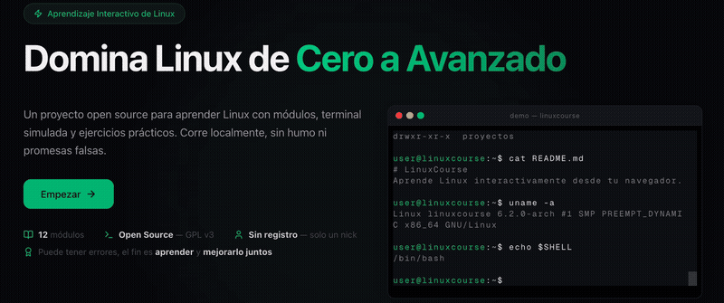
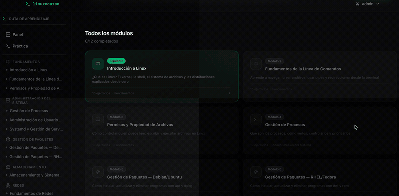
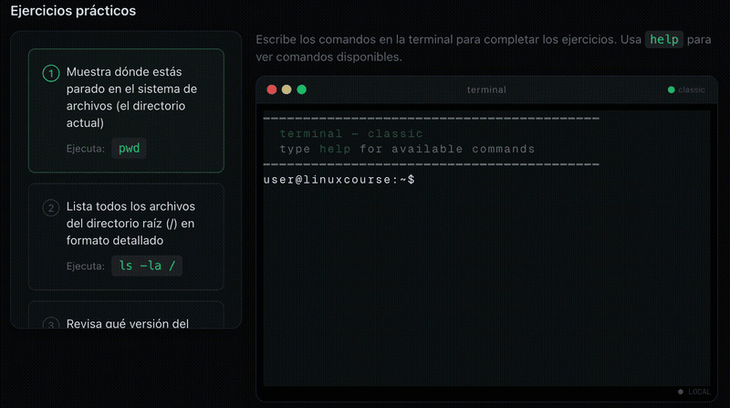

# LinuxCourse 🐧

Plataforma interactiva para aprender Linux desde cero hasta nivel avanzado, con terminal simulada, módulos estructurados, ejercicios prácticos y quizzes.



## Stack

- **Next.js 16** — App Router, API Routes
- **React 19** — Client Components, Hooks, Context
- **Tailwind CSS v4** — Estilos utilitarios
- **Prisma 7 + SQLite** — Base de datos y ORM
- **TypeScript** — Tipado estático
- **xterm.js** — Terminal embebida en el navegador
- **node-pty** — Terminal real vía WebSocket (opcional)

## Características

- 12 módulos de aprendizaje progresivos
- Terminal simulada con 70+ comandos y VFS
- Conexión WebSocket a terminal real (bash)
- Ejercicios prácticos con verificación automática
- Quizzes interactivos
- Sistema de progreso, puntuación y rachas
- Logros desbloqueables
- Autenticación con JWT y cookies httpOnly

## Requisitos

- **Node.js 20+**
- **npm**

## Setup

```bash
# 1. Clonar el repositorio
git clone <repo-url>
cd linuxcourse

# 2. Instalar dependencias
npm install

# 3. Generar cliente de Prisma
npx prisma generate

# 4. Configurar variables de entorno
cp .env.example .env

# 5. Inicializar base de datos y seed
npm run db:seed

# 6. Iniciar servidor de desarrollo
npm run dev
```

Abrir [http://localhost:3000](http://localhost:3000).

Para la terminal real (WebSocket):

```bash
npm run dev:all
```

## Scripts

| Comando | Descripción |
|---------|-------------|
| `npm run dev` | Servidor de desarrollo Next.js |
| `npm run build` | Build de producción |
| `npm run start` | Servidor de producción |
| `npm run lint` | ESLint |
| `npm run db:seed` | Poblar base de datos con contenido |
| `npm run terminal-ws` | Servidor WebSocket para terminal real |
| `npm run dev:all` | Next.js + WebSocket en paralelo |

## Variables de Entorno

Solo necesitas crear `.env` (copiando `.env.example`) con:

```env
DATABASE_URL="file:./dev.db"
NEXT_PUBLIC_APP_URL="http://localhost:3000"
```

## Privacidad

Todo corre **localmente** en tu máquina. No hay servidores externos, no se recopilan datos, no hay telemetría. Tu progreso, sesión e información nunca salen de tu computadora.

## Disclaimer

Este proyecto está **en desarrollo activo**. El contenido puede contener errores, omisiones o inexactitudes. Si encuentras algo incorrecto, [abre un issue](https://github.com/GusAguilra/linuxcourse/issues) o manda un PR — toda contribución es bienvenida.

## Demo





## Estructura del Proyecto

```
src/
├── app/           # Páginas (App Router)
│   ├── modules/   # Vista de módulos con contenido, ejercicios y quiz
│   ├── dashboard/ # Panel principal del estudiante
│   ├── practice/  # Práctica libre en terminal
│   ├── profile/   # Perfil y progreso
│   └── api/       # API Routes
├── components/    # Componentes React
│   └── ui/        # Primitivas de UI
├── content/       # Contenido de cada módulo en markdown
├── data/          # Datos estáticos (módulos, ejercicios, quizzes)
└── lib/           # Utilidades y lógica compartida
```
